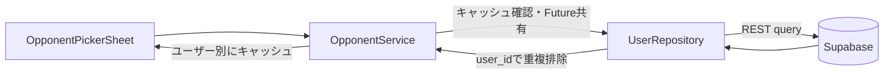

# Tennis Rival 開発環境セットアップガイド

開発チームへようこそ！このアプリは、表側の画面を「Flutter」、裏側のデータベースを「Supabase」という技術で作っています。
お使いのPC（Mac / Windows）に合わせて、順番に環境を構築していきましょう。

---

## 💡 なぜこれらのツールを入れるの？（基礎知識）

作業を始める前に、これから入れるツールの役割を簡単に説明します。

* **VS Code (Visual Studio Code)**
  コードを書くための高機能な専用ノートです。今回はこれを使ってすべての作業を行います。
* **Docker Desktop**
  PCの中に「アプリ専用の安全な隔離部屋」を作るツールです。裏側のデータベース（Supabase）は複雑なシステムなので、あなたのPCを汚さずにそのまま動かすために絶対必要になります。
* **WSL (Windowsのみ)**
  Windowsの中でDockerを動かすための「Linuxの土台」です。Macには最初から似た仕組みがあるため不要です。
* **Flutter SDK**
  スマホアプリを作るための「道具箱」です。これをPCに直接入れることで、スマホの画面をPC上に表示できるようになります。

---

## 🍎 Mac用 セットアップ手順

Macを使っている方向けの手順です。順番通りに進めてください。

### 1. VS Codeのインストール
1. [VS Code公式サイト](https://code.visualstudio.com/)にアクセスし、「Download Mac Universal」をクリックします。
2. ダウンロードしたZipファイルをダブルクリックして解凍します。
3. 出てきた青いリボンのアイコン（Visual Studio Code）を、Macの「アプリケーション」フォルダにドラッグ＆ドロップして移動させます。

### 2. Docker Desktopのインストール
1. [Docker公式サイト](https://www.docker.com/products/docker-desktop/)にアクセスし、「Download for Mac」をクリックします。（※お使いのMacがM1/M2チップなら「Apple Silicon」、Intel製なら「Intel chip」を選んでください）
2. ダウンロードした `.dmg` ファイルを開き、Dockerのアイコンを「Applications」フォルダにドラッグします。
3. アプリケーションから「Docker」を起動します。
4. 規約画面が出たら「Accept」を押し、設定画面では **「Use recommended settings（推奨設定を使用）」** にチェックを入れて「Finish」を押します。
5. Macのパスワードを聞かれたら入力します。画面左下に緑色で「Engine running」と出れば準備完了です。このアプリは裏で開いたままにしておきます。

### 3. Flutter SDKのインストール
1. [Flutter公式サイト](https://docs.flutter.dev/get-started/install/macos)から、Mac用の最新SDK（Zipファイル）をダウンロードします。
2. ダウンロードしたファイルを解凍し、出てきた `flutter` フォルダを、ご自身の「ホームフォルダ（家のマークのフォルダ）」の中に移動させます。

### 4. プロジェクトのダウンロードと起動
1. VS Codeを開きます。
2. 画面上部のメニューバーから「ターミナル」＞「新しいターミナル」をクリックします。画面下部に黒い入力欄が出ます。
3. 以下のコマンドを1行ずつコピーして貼り付け、Enterを押します。
   ```bash
   # 1. コードをダウンロード
   git clone [https://github.com/hikahikahikaru/tennis_rival.git](https://github.com/hikahikahikaru/tennis_rival.git)
   
   # 2. ダウンロードしたフォルダに移動
   cd tennis_rival
   
   # 3. データベース（Supabase）を起動
   supabase start
   
   # 4. アプリ（Flutter）のフォルダへ移動
   cd mobile
   
   # 5. アプリを起動
   flutter run
   ```

---

## 💡 毎回の開発の進め方（重要）

環境構築が終わった後の、日々の作業の進め方です。
VS Codeの開き方と、ターミナル（黒い画面）の使い分けがポイントになります。

### 1. VS Codeの正しい開き方
1. VS Codeを起動します。
2. メニューの「ファイル」＞「フォルダーを開く」から、一番大元の `tennis_rival` フォルダ（Windowsなら `C:\github\tennis_rival` など）を開きます。
3. 画面左側のファイル一覧に、`mobile` フォルダと `supabase` フォルダの両方が見えている状態が正解です。

### 2. ターミナルを2つ立ち上げる（役割分担）
VS Codeの画面下部にあるターミナルパネルで、右上の「＋」ボタンや下向き矢印を使い、役割の違うターミナルを同時に2つ開いて切り替えながら使います。

#### 【ターミナル1：データベース用（Supabase）】
裏側のデータを動かすためのターミナルです。

* **[Macの場合]**
  * 種類: デフォルトのターミナル（zsh等）
  * やること: `supabase start` を実行
* **[Windowsの場合]**
  * 種類: `Ubuntu (WSL)`（「＋」ボタン横の矢印から選択）
  * やること: `cd /mnt/c/github/tennis_rival` を実行してから、`supabase start` を実行

#### 【ターミナル2：アプリ用（Flutter）】
スマホの画面を表示・更新するためのターミナルです。

* **[Mac/Windows 共通]**
  * 種類: デフォルトのターミナル（Macならzsh、WindowsならPowerShell）
  * やること: `cd mobile` を実行してアプリフォルダに入り、`flutter run` を実行

---
※作業を終了する時は、ターミナルで `Ctrl + C` を押すとそれぞれ停止できます。（データベースは `supabase stop` でも停止可能です）

---

## 現在のプロジェクト構成

現在の `#21` ブランチでは、Flutter側の処理を役割ごとに分けています。

```text
tennis_rival/
├── mobile/
│   ├── lib/
│   │   ├── constants/       # 色、サイズ、文言、スタイル、接続設定
│   │   ├── mocks/           # ログイン前の開発用ダミーデータ
│   │   ├── models/          # データ構造とデータ自身の変換・判定
│   │   ├── repositories/    # Supabaseなど外部データソースとの通信
│   │   ├── screens/         # 画面単位のWidgetと画面遷移
│   │   ├── services/        # キャッシュ、状態、ユースケースの制御
│   │   ├── widgets/         # 再利用する、または意味のあるUI部品
│   │   └── main.dart        # Supabase初期化とアプリ起動
│   ├── test/
│   │   ├── models/          # Modelのテスト
│   │   ├── repositories/    # Repositoryのテスト
│   │   ├── services/        # Serviceのテスト
│   │   └── widgets/         # Widgetのテスト（必要に応じて作成）
│   ├── .env.example         # 接続設定のサンプル
│   ├── pubspec.yaml         # Flutter依存パッケージ
│   └── analysis_options.yaml # Dart lint設定
├── supabase/
│   ├── migrations/          # DBスキーマ変更履歴
│   ├── seed.sql             # ローカルDBの初期データ
│   └── config.toml          # ローカルSupabaseのポート等
└── README.md
```

### 各フォルダの役割

- `models/`: データの構造、JSON変換、データ自身の判定を置きます。DB通信や画面遷移は置きません。
- `repositories/`: Supabaseなど外部サービスへの問い合わせと、取得データのModel変換を置きます。キャッシュは管理しません。
- `services/`: Repositoryを利用したユースケース、キャッシュ、通信中状態、再試行制御を置きます。
- `screens/`: 画面全体の状態管理と画面遷移を置きます。
- `widgets/`: 表示とユーザー操作を担当するUI部品を置きます。DBクエリは直接書きません。
- `constants/`: アプリ全体で共有する文言、色、サイズ、TextStyle、設定値を置きます。
- `mocks/`: ログイン未実装時やテスト時だけ使うダミーデータを置きます。
- `migrations/`: DBのテーブルや制約を変更するSQLを履歴として追加します。
- `seed.sql`: ローカルDBの初期データを定義します。`supabase db reset` で再投入されます。

---

## Supabase接続と対戦相手取得

### 接続設定

Supabaseの初期化は [mobile/lib/main.dart](mobile/lib/main.dart) で行います。URLとPublishable keyは [mobile/lib/constants/supabase_constants.dart](mobile/lib/constants/supabase_constants.dart) の `String.fromEnvironment` から読み込みます。

ローカル開発では引数を省略すると、Windowsの予約ポートとの衝突を避けた `http://127.0.0.1:44321` に接続します。環境を明示する場合は、`.env.example` を `.env` にコピーして以下を実行します。

```powershell
cd mobile
Copy-Item .env.example .env
flutter run -d windows --dart-define-from-file=.env
```

`anon` / Publishable keyはクライアントに含まれる公開用キーです。Secret keyや`service_role` keyはRLSを迂回できるため、ソースコードやGitに保存しません。

### 対戦相手取得の処理フロー



- `UserRepository`: `group_members` と `users` を問い合わせ、同じグループの自分以外のユーザーを取得します。
- `UserRepository`: 複数グループに所属する同じユーザーを `user_id` で重複排除します。
- `OpponentService`: ユーザーIDに紐付けてキャッシュします。
- `OpponentService`: 通信中の `Future` を共有し、起動直後の呼び出しでも空リストを即返却しません。
- `OpponentPickerSheet`: ローディング、通信エラー、候補0人、候補一覧を分けて表示し、通信エラー時は再試行できます。

現在はログイン機能未実装のため、基準ユーザーは `mocks/mock_data.dart` の仮ユーザーです。認証実装時は Supabase Auth のユーザーIDへ切り替え、ユーザー変更時にはキャッシュを破棄します。

---

## コーディングルール

### 1. レイヤーの責務を混ぜない

- `models/`: `UserModel` やスコアなどのデータ構造、JSON変換、データ自身の判定を置きます。Supabaseへの通信や画面遷移は置きません。
- `repositories/`: DB・API・外部サービスとの通信、レスポンスのModel変換を置きます。キャッシュやWidgetの状態は管理しません。
- `services/`: Repositoryを組み合わせたユースケース、キャッシュ、通信中状態、再試行制御を置きます。
- `screens/`: 画面全体の状態と画面遷移を置きます。
- `widgets/`: 表示とユーザー操作を置きます。DBクエリを直接書きません。
- `constants/`: アプリ全体で共有する文言、色、サイズ、TextStyle、設定値を置きます。
- `mocks/`: ログイン未実装時やテスト時だけ使うダミーデータを置きます。本番データと混同しない名前にします。

### 2. ベタ打ちを避ける（Rule 2）

- 画面に表示する文言は `AppStrings` に集約します。
- 色は `AppColors`、寸法や余白は `AppSizes`、TextStyleは `AppTextStyles` に集約します。
- API URLやキーなどの環境依存値は `--dart-define` から読み込み、接続設定クラスで参照します。
- 同じ数値や文言を複数箇所に直接書かず、意味のある名前を付けます。
- ただし、一度しか使わない値まで無理に定数化して、読みやすさを下げないようにします。

### 3. 非同期処理とエラーを正しく扱う

- `Future` を返す処理は、呼び出し側が完了を待てるAPIにします。
- 同じ取得処理が進行中なら、通信中の `Future` を共有して二重取得を防ぎます。
- 通信失敗を「データが0件」として扱いません。例外をUIまで伝え、エラー表示と再試行を用意します。
- `mounted` を確認してから、非同期処理後のWidgetの状態を更新します。
- ユーザーや条件が変わる取得処理では、古いレスポンスが新しいキャッシュを上書きしないようにします。

### 4. ModelとIDの扱い

- 表示名だけでユーザーを識別せず、DB登録に必要な `user_id` をModelで保持します。
- 対戦相手を選択したときは、表示用の名前と登録用のIDを同じ `UserModel` から取得します。
- ユーザー別キャッシュには必ず基準ユーザーのIDを紐付けます。

### 5. コメントと命名

- コメントは「何をしているか」よりも「なぜその処理が必要か」を補足します。
- 既存コメントを変更する場合は、処理と内容が一致するようにします。
- Dartの命名規則に従い、クラスは`PascalCase`、メソッド・変数は`camelCase`、定数は意味が分かる名前にします。
- 1文字変数名や、責務が分からない汎用名は避けます。

### 6. Widgetの分割

- 複数画面で再利用するUI、または単独で意味のあるUIは `widgets/` に切り出します。
- その画面でしか使わない小さな表示処理は、まず同じファイル内のプライベートメソッドで整理します。
- 切り出しによって責務が明確になるか、テストしやすくなるか、再利用できるかを基準に判断します。
- ファイルを分けること自体を目的にせず、読みやすさと変更しやすさを優先します。

### 7. テスト

- ロジックを変更したら、関連するテストを追加・更新します。
- 通信を伴うクラスはRepositoryを差し替えられるようにし、Serviceのテストを実DBへ依存させません。
- 少なくとも正常系、空データ、通信エラー、再試行、キャッシュ、並行呼び出しを確認します。
- ユーザー別キャッシュを扱う場合は、ユーザー切り替えと古い通信結果の上書きが起きないことも確認します。
- 実行前後で、既存のテストが壊れていないことを確認します。

---

## テスト・静的解析

```powershell
cd mobile
flutter analyze
flutter test
```

変更後は、少なくとも `flutter analyze` と `flutter test` を実行します。Windowsのプラグインビルドで「symlink support」が求められた場合は、Windowsの開発者モードを有効にします。

---

## DB変更とデバッグ確認

DBのテーブルや制約を変更するときは、 [supabase/migrations/20260901093033_initial_schema.sql](supabase/migrations/20260901093033_initial_schema.sql) を直接書き換えず、新しい日時付きSQLファイルを追加します。ローカル用の初期データは [supabase/seed.sql](supabase/seed.sql) に追加します。

`supabase db reset` を実行すると、ローカルDBがリセットされ、MigrationとSeedが順に適用されます。現在のSeedには、同じユーザーが複数グループに所属する重複排除確認用のデータも含まれています。

画面で確認する場合は、Supabaseを起動した状態で試合結果の記録画面を開き、「対戦相手」を選択します。通信成功時の候補一覧、候補0人、通信エラー時の再試行ボタンを、それぞれ別の状態として確認します。

---

## Git・Pull Requestのルール

- 1つのコミットには、関連する変更だけを含めます。
- 設定変更と機能変更を分けられる場合は、別コミットにします。
- コミットメッセージは「どこを、なぜ変えたか」が分かる内容にします。
- PRには、目的、変更箇所、動作確認手順、テスト結果、既知の制約を記載します。
- `.env`、Secret key、`service_role` key、個人情報はコミットしません。
- Flutterが自動生成するOS固有ファイルは、リポジトリのGit管理方針に従い、手動編集しません。

---

## 現在の制約と今後の対応

- ログイン機能未実装のため、現在の基準ユーザーは `mocks/mock_data.dart` の仮ユーザーです。
- 認証実装時は `Supabase.instance.client.auth.currentUser?.id` を利用し、ログアウトやユーザー変更時にキャッシュを破棄します。
- 本番環境のURLとPublishable keyは、環境ごとの `--dart-define` またはCI/CDのシークレットから注入します。
- 試合結果のDB登録では、選択した `UserModel.id` を対戦相手の外部キーとして利用します。
